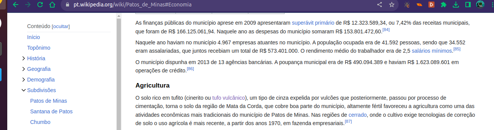

# Missão Mar da Prata

Estou coletando dados e informações afim de comprovar ou descartar a veracidade da hipótese de quem houve um mar interior na região de Presidente Olegário-MG, que esse mar ou lago interior ficava na região hoje conhecida como Prata dos netos, e que a ocupação humana primitiva que houve na região pode estar relacionada à ocorrência/existência desse mar interior

## Sobre

Esse projeto vai reunir imagens, mapas, fotos locais de amostras entre outros indícios que corroborem ou desprovem a existência desse suposto mar/lago interior

## Indício novo #1

## Mais indícios serão adicionados